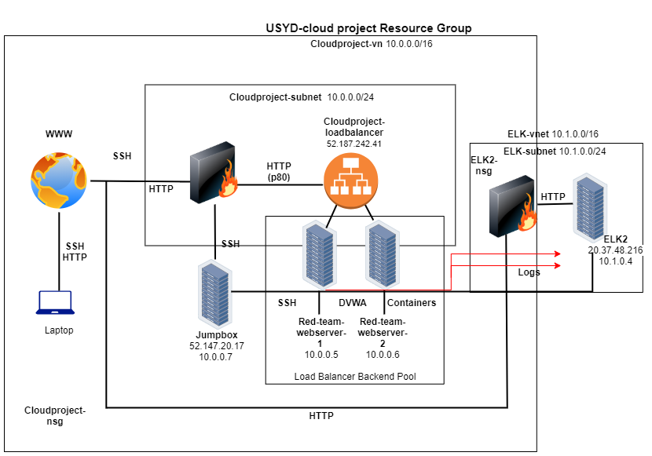

## Automated ELK Stack Deployment

The files in this repository were used to configure the network depicted below.

**Note**: The following image link needs to be updated. Replace `USYD_cloud_project.png` with the name of your diagram image file.  

These files have been tested and used to generate a live ELK deployment on Azure. They can be used to either recreate the entire deployment pictured above. Alternatively, select portions of the ansible file may be used to install only certain pieces of it, such as Filebeat.

  - _TODO: Enter the playbook file._
    
This document contains the following details:
- Description of the Topology
- Access Policies
- ELK Configuration
  - Beats in Use
  - Machines Being Monitored
- How to Use the Ansible Build

### Description of the Topology

The main purpose of this network is to expose a load-balanced and monitored instance of DVWA, the D*mn Vulnerable Web Application.

Load balancing ensures that the application will be highly available, in addition to restricting access to the network. The advantage of a jumpbox is that it allows secure access via ssh.
- _TODO: What aspect of security do load balancers protect? What is the advantage of a jump box?_

Integrating an ELK server allows users to easily monitor the vulnerable VMs for changes to the metrics and system files.
- _TODO: What does Filebeat watch for?_A: Changes to files and identity of who accessed them.
- _TODO: What does Metricbeat record?_A: Changes to metrics such as unexpected change in CPU usage. 

The configuration details of each machine may be found below.
_Note: Use the [Markdown Table Generator](http://www.tablesgenerator.com/markdown_tables) to add/remove values from the table_.

| Name     | Function | IP Address | Operating System |
|----------|----------|------------|------------------|
| Jump Box | Gateway  | 10.0.0.1   | Linux            |
| Red-team-| Webserver| 10.0.0.5   | Linux            |
| webserver|          |            |                  |
| -1       |          |            |                  | 
| Red-team-| Webserver| 10.0.0.6   | Linux            |
| webserver|          |            |                  |  
| -2       |          |            |                  |
| ELK2     | Monitor  | 10.1.0.4   | Linux            |
|          | traffic  |            |                  |         

### Access Policies

The machines on the internal network are not exposed to the public Internet. 

Only the jumpbox machine can accept connections from the Internet. Access to this machine is only allowed from the following IP addresses:
- _TODO: My public IP (floating IP)_

Machines within the network can only be accessed by the jumpbox.
- _TODO: Which machine did you allow to access your ELK VM? What was its IP address?_

A summary of the access policies in place can be found in the table below.

| Name     | Publicly Accessible | Allowed IP Addresses |
|----------|---------------------|----------------------|
| Jump Box | Yes/No              | 10.0.0.1 10.0.0.2    |
|          |                     |                      |
|          |                     |                      |

### Elk Configuration

Ansible was used to automate configuration of the ELK machine. No configuration was performed manually, which is advantageous because...
- _TODO: What is the main advantage of automating configuration with Ansible?_A: Faster deployment with less risk of human error creeping into the process.

The playbook implements the following tasks:
- _TODO: In 3-5 bullets, explain the steps of the ELK installation play. E.g., install Docker; download image; etc._
- Install docker.io
- Install pip3
- Install Docker python module
- Use more memory
- Download and launch a docker elk container

The following screenshot displays the result of running `docker ps` after successfully configuring the ELK instance.
images/ELK works dockers installed.png

**Note**: The following image link needs to be updated. Replace `docker_ps_output.png` with the name of your screenshot image file.  

### Target Machines & Beats
This ELK server is configured to monitor the following machines:
- _TODO: List the IP addresses of the machines you are monitoring_
A: 10.0.0.5
   10.0.0.6
We have installed the following Beats on these machines:
- _TODO: Specify which Beats you successfully installed_
Filebeat
Metricbeat
These Beats allow us to collect the following information from each machine:
Filebeat monitors file access, events, user identities and IPs accessing files. e.g. responses of file requests.
Metricbeat monitors CPU, RAM, GPU, power consumption. e.g. For unexpected increases in activity. 
in activity.
- _TODO: In 1-2 sentences, explain what kind of data each beat collects, and provide 1 example of what you expect to see. E.g., `Winlogbeat` collects Windows logs, which we use to track user logon events, etc._

### Using the Playbook
In order to use the playbook, you will need to have an Ansible control node already configured. Assuming you have such a control node provisioned: 

SSH into the control node and follow the steps below:
- Copy the YAML file to ansible.
- Update the YAML file to include IPs of the webservers and ELK machine
- Run the playbook, and navigate to Kibana to check that the installation worked as expected.

_TODO: Answer the following questions to fill in the blanks:_
- _Which file is the playbook? Where do you copy it?_
A: install-elk.yml, installed in ansible
- _Which file do you update to make Ansible run the playbook on a specific machine? How do I specify which machine to install the ELK server on versus which to install Filebeat on?_
A: /etc/ansible/hosts
- _Which URL do you navigate to in order to check that the ELK server is running? http://20.37.48.216:5601/app/kibana#/home

_As a **Bonus**, provide the specific commands the user will need to run to download the playbook, update the files, etc._
ansible-playbook install-elk.yml
ansible-playbook pentest.yml
ansible-playbook filebeat-playbook.yml
ansible-playbook metricbeat-playbook.yml